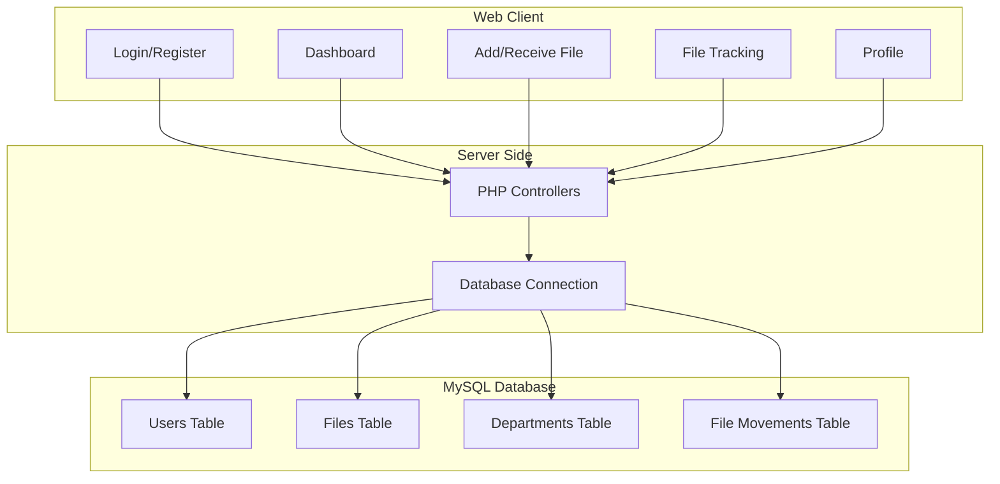

# File Tracking System

## Introduction

File Tracking System is a web-based application for managing the movement and status of files within an organization. It enables users to add, receive, and track files efficiently, ensuring transparency and accountability. The system is built using PHP, HTML, CSS, JavaScript, and MySQL, and is suitable for organizations that need to monitor file workflows and maintain records of file handling activities.

## Features

- User registration and login authentication
- Dashboard displaying file status and statistics
- Add new files with details such as department, description, and sender/receiver details
- File tracking history showing movements and status changes
- Receive files and update their status
- Search and filter files by various parameters
- Admin features for managing users and departments
- User profile management

## Installation

To install and set up the File Tracking System, follow these steps:

1. Clone the repository to your local machine:

   ```bash
   git clone https://github.com/Rajdeep0511/File-Tracking-System.git
   ```

2. Move the project files to your web server directory (e.g., `htdocs` for XAMPP or `www` for WAMP).
3. Import the `file_tracking.sql` file into your MySQL database to create the required tables and sample data.
4. Update the database configuration in the project as per your database credentials.
5. Start your web server and open the application in your web browser.

## Requirements

- Web server (e.g., Apache)
- PHP 7.0 or higher
- MySQL 5.6 or higher
- Web browser (Chrome, Firefox, Edge, etc.)
- Composer (optional, if using PHP dependencies)

## Configuration

To configure the File Tracking System for your environment:

1. Open the configuration file for database connection (commonly named `config.php` or located in the root or `includes` directory).
2. Set the database host, username, password, and database name as per your MySQL setup:
   
   ```php
   $host = 'localhost';
   $user = 'your_db_user';
   $password = 'your_db_password';
   $database = 'file_tracking';
   ```
   
3. Save the configuration file.
4. Ensure file and folder permissions are correctly set for the web server to read and write as needed.

## Usage

### User Registration and Login

- Register a new user account or log in with existing credentials.
- Admin users have privileges to manage other users and departments.

### Dashboard

- After logging in, users are directed to the dashboard.
- The dashboard displays file statistics, recent file movements, and quick actions.

### Adding a File

- Use the “Add File” option to create a new file entry.
- Enter department, description, sender, and receiver details.
- The file is added to the tracking system and is visible in the dashboard and file lists.

### Receiving a File

- View the list of files assigned to the user.
- Use the “Receive” action to update the file status and optionally enter remarks.

### File Tracking

- Search and filter files using the provided search panel.
- View complete file movement history, including sender, receiver, and status changes.

### Admin Features

- Admin users can add or remove departments.
- Manage user accounts, reset passwords, and assign roles.

### Profile Management

- Users can view and update their profile information.
- Change password functionality is available.

---

## System Diagram

Below is a high-level overview of the system architecture and workflow:



---

## API Endpoints

| Method | URL                |
|--------|--------------------|
| POST   | `/add_file.php`    |
| POST   | `/receive_file.php`|
| POST   | `/login.php`       |
| GET    | `/search_files.php`|

---

For more details, refer to the respective PHP, HTML, and SQL files in the repository.

---

## License

This project is licensed under the MIT License. Please see the LICENSE file for more details.
